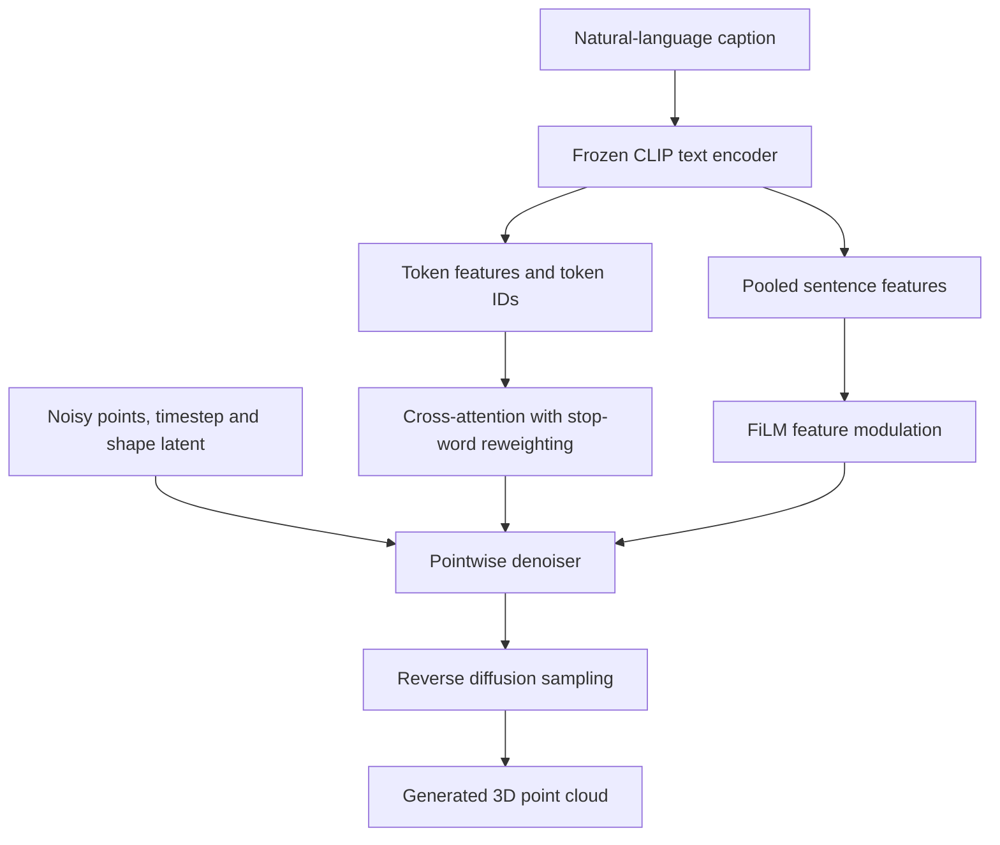

# Text-Conditioned Diffusion Model for 3D Point Cloud Generation

**Hyunjun Jang · Jung chan-Cho**  
*The Journal of Korean Institute of Next Generation Computing*, 22(3), 101–116, June 2026.

[Paper / DOI](https://doi.org/10.23019/kingpc.22.3.202606.007) · [KCI](https://www.kci.go.kr/kciportal/landing/article.kci?arti_id=ART003355453) · [Publisher listing](https://www.earticle.net/Article/A487575)

Research code for generating 3D point clouds from natural-language descriptions using a CLIP-conditioned diffusion model.

## Overview

A caption can specify both an object category and its shape attributes. This work studies how to incorporate that information into point-cloud denoising through **token-level cross-attention**, **sentence-level feature modulation**, and **stop-word-aware attention reweighting**.

The paper evaluates chair and table generation, examines token attention, and reports an ablation of attention reweighting. Fine-grained attribute grounding and generalization beyond the evaluated categories remain limitations.

## Method and implementation

The current generator uses a PointNet shape encoder and a pointwise diffusion denoiser. Both Gaussian and flow-based latent-prior variants are available. The text encoder is frozen.



| Component | Current implementation |
| --- | --- |
| Text encoding | `FrozenCLIPTextEmbedder` returns token embeddings, pooled features and token IDs; the default CLIP model is `openai/clip-vit-base-patch32`. |
| Token conditioning | Point features query text tokens through cross-attention at the 256- and 512-dimensional feature stages. |
| Sentence conditioning | FiLM modulates denoiser features using the pooled text representation. |
| Stop-word reweighting | After softmax, attention at recognized stop-word positions is multiplied by 0.1 by default, then renormalized. Tokens remain in the sequence. |
| Shape latent | `FlowVAE` and `GaussianVAE` use `PointNetEncoder`. A PointCNN implementation is also retained in the repository. |
| Sampling | Iterative denoising generates point coordinates from Gaussian noise, conditioned on text and a sampled shape latent. |
| Attention inspection | The denoiser can return attention weights from both conditioning stages. |

The directory name reflects earlier development. The current generator does not require part-segmentation labels.

## Published results

The following values are reported in the [published abstract](https://www.kci.go.kr/kciportal/landing/article.kci?arti_id=ART003355453), using its reporting scale.

| Category | MMD-CD | COV-CD (%) | 1-NN-CD (%) | JSD |
| --- | ---: | ---: | ---: | ---: |
| Chair | 6.80 | 49.75 | 77.99 | 9.6 |
| Table | 6.33 | 43.75 | 71.75 | 13.2 |

In the chair ablation, stop-word-aware reweighting increased COV-CD from **37.18% to 49.75%** and reduced JSD from **12.2 to 9.6**.

Lower MMD-CD and JSD indicate closer distributions; higher coverage indicates broader reference-set coverage. For balanced generated/reference sets, 1-NN accuracy near 50% indicates less distinguishable distributions.

These are publication results, not measurements from a fresh run of this checkout. Raw script outputs may use different scales; match the paper's normalization, splits and evaluation settings before comparing.

## Repository guide

| Path | Purpose |
| --- | --- |
| [train_gen.py](train_gen.py) | Train a text-conditioned generator. |
| [test_gen.py](test_gen.py) | Generate samples from a checkpoint and compute CD-based distribution metrics and JSD. |
| [models/clip_encoder.py](models/clip_encoder.py) | Frozen CLIP text encoder. |
| [models/attention.py](models/attention.py) | Cross-attention and stop-word reweighting. |
| [models/diffusion.py](models/diffusion.py) | Denoiser, FiLM, diffusion schedule, losses and sampling. |
| [models/vae_flow.py](models/vae_flow.py) / [models/vae_gaussian.py](models/vae_gaussian.py) | Generator variants. |
| [utils/dataset.py](utils/dataset.py) | Point-cloud loading and model-ID-based caption matching. |
| [create_tablechair_hdf5.py](create_tablechair_hdf5.py) | Chair/table HDF5 preparation helper. |
| [visualize_random_captions.py](visualize_random_captions.py) / [visualize_training_samples.py](visualize_training_samples.py) | Generation and attention visualization tools. |
| [ATTENTION_VISUALIZATION_GUIDE.md](ATTENTION_VISUALIZATION_GUIDE.md) | Additional visualization documentation. |
| [EVALUATION_GUIDE.md](EVALUATION_GUIDE.md) | Additional evaluation documentation; check the scripts for current arguments. |

Legacy autoencoder and generation scripts remain available for earlier experiments.

## Setup

Clone the repository:

```bash
git clone https://github.com/Hyunjun0716/3Dpartsupervison.git
cd 3Dpartsupervison
```

Use a Python environment with a PyTorch build appropriate for your GPU and CUDA installation. The text-conditioned code imports `transformers` and `pandas` in addition to the scientific-computing dependencies:

```bash
python -m pip install numpy scipy h5py pandas tqdm tensorboard scikit-learn matplotlib transformers
```

Install PyTorch separately for your hardware. CLIP model/tokenizer files are downloaded on first use unless cached.

**Environment status:** [env.yml](env.yml) is a legacy environment snapshot with Python 3.7, PyTorch 1.6 and CUDA 10.1. It omits text-conditioning dependencies and is not a complete environment specification for the current code. A fully pinned environment for the present checkout is not provided.

## Data preparation

Prepare these external files before training:

| File | Expected contents |
| --- | --- |
| `data/shapenet_tablechair.hdf5` | Chair (`03001627`) and table (`04379243`) groups, each containing `train`, `val` and `test` point-cloud arrays of shape `(num_shapes, num_points, 3)`. |
| `data/captions.tablechair.csv` | At least the columns `modelId` and `description`. |
| `data/modelid_mapping_tablechair.json` | Keys such as `03001627_train`; each entry contains an `available_model_ids` list aligned with the HDF5 row order. |

`ShapeNetCoreText` retains shapes with matching model IDs in the caption dictionary. Check that each mapping list follows the actual stored point-cloud order, especially if source files were skipped during preprocessing.

[create_tablechair_hdf5.py](create_tablechair_hdf5.py) contains machine-specific paths that must be adapted before use. Its default preprocessing stores 2,048 points per shape; the current training loop downsamples to 1,024 points.

Datasets and trained checkpoints are not bundled in `data/` or `pretrained/`.

## Training

Example invocation using the current command-line interface:

```bash
python train_gen.py \
    --model flow \
    --dataset_path ./data/shapenet_tablechair.hdf5 \
    --captions_path ./data/captions.tablechair.csv \
    --categories chair,table \
    --use_text_condition True \
    --train_batch_size 8 \
    --device cuda
```

The training script currently uses `./data/modelid_mapping_tablechair.json` directly. Place the corresponding mapping there even if you override the dataset or caption paths.

The default latent dimension is 256 and the default diffusion schedule has 100 steps. Training runs without a finite iteration limit by default; set `--max_iters` for a bounded run. Use `--resume` to resume from a checkpoint.

Inspect the available options:

```bash
python train_gen.py --help
```

The implementation also includes an optional alignment-loss branch. Its predicted point cloud is detached before entering the auxiliary shape encoder, so this branch does not directly backpropagate through that predicted cloud into the denoiser. Consult the code when designing loss ablations.

## Generation and evaluation

Replace the checkpoint path below with your own trained checkpoint. The example requires the prepared test data and caption files.

`test_gen.py` defaults to `./data/modelid_mapping.json`, whereas training uses the table/chair mapping filename. For this dataset, copy the same mapping to the test loader's expected location:

```bash
cp ./data/modelid_mapping_tablechair.json ./data/modelid_mapping.json

python test_gen.py \
    --ckpt ./pretrained/YOUR_CHECKPOINT.pt \
    --dataset_path ./data/shapenet_tablechair.hdf5 \
    --captions_path ./data/captions.tablechair.csv \
    --categories chair,table \
    --use_text_condition True \
    --sample_num_points 1024 \
    --batch_size 8 \
    --device cuda
```

Evaluate categories separately when comparing with the publication's per-category table, using `--categories chair` or `--categories table`.

By default, generation uses captions from the test set. Add `--text_prompt "a chair with armrests"` to use one prompt for all generated samples in that evaluation run. This script still loads a reference dataset.

Generated point clouds are saved as `out.npy` in a timestamped directory under `results/`. The script reports MMD-CD, COV-CD, 1-NN-CD and JSD. EMD is not implemented in the current evaluation path.

Keep the point count, normalization, reference split and sample count consistent across comparisons. Training-time validation scores and final test scores may use different settings.

## Citation

If you use this work, please cite:

```bibtex
@article{jang2026textconditioned,
  author  = {Hyunjun Jang and Jung chan-Cho},
  title   = {Text-Conditioned Diffusion Model for 3D Point Cloud Generation},
  journal = {The Journal of Korean Institute of Next Generation Computing},
  year    = {2026},
  volume  = {22},
  number  = {3},
  pages   = {101--116},
  doi     = {10.23019/kingpc.22.3.202606.007}
}
```

## Acknowledgements and license

This project builds on [Diffusion Probabilistic Models for 3D Point Cloud Generation](https://arxiv.org/abs/2103.01458) by Shitong Luo and Wei Hu and the [original implementation](https://github.com/luost26/diffusion-point-cloud).

The repository retains the original [MIT License](LICENSE) and copyright notice.

Questions about this implementation can be raised in [this repository's issue tracker](https://github.com/Hyunjun0716/3Dpartsupervison/issues).
