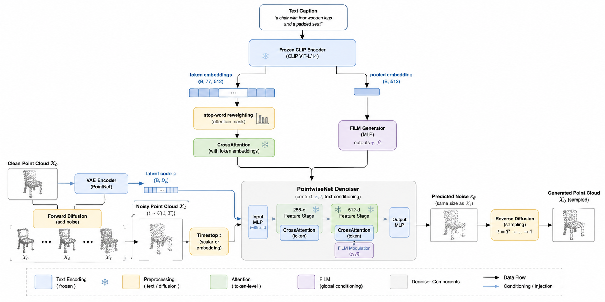

# Text-Conditioned Diffusion Model for 3D Point Cloud Generation

**Hyunjun Jang · Jung chan-Cho**  
*The Journal of Korean Institute of Next Generation Computing*, 22(3), 101–116, June 2026.

[Paper / DOI](https://doi.org/10.23019/kingpc.22.3.202606.007) · [KCI](https://www.kci.go.kr/kciportal/landing/article.kci?arti_id=ART003355453) · [Publisher listing](https://www.earticle.net/Article/A487575)

Research code for generating 3D point clouds from natural-language descriptions using a CLIP-conditioned diffusion model.

## Overview



*Overview of the text-conditioned diffusion architecture. Author-provided figure, reproduced without modification.*

This work conditions point-cloud denoising on both individual text tokens and sentence-level semantics. A frozen CLIP text encoder supplies token embeddings for cross-attention and pooled features for FiLM modulation. Stop-word-aware reweighting reduces attention to predefined low-information words while preserving the token sequence.

The current generator uses a PointNet shape encoder and a pointwise diffusion denoiser, with Gaussian or flow-based latent priors. Chair and table are the evaluated categories. Fine-grained attribute grounding and broader category generalization remain limitations.

## Results


The following values are reported in the [published abstract](https://www.kci.go.kr/kciportal/landing/article.kci?arti_id=ART003355453), using its reporting scale.

| Category | MMD-CD | COV-CD (%) | 1-NN-CD (%) | JSD |
| --- | ---: | ---: | ---: | ---: |
| Chair | 6.80 | 49.75 | 77.99 | 9.6 |
| Table | 6.33 | 43.75 | 71.75 | 13.2 |

In the chair ablation, stop-word-aware reweighting increased COV-CD from **37.18% to 49.75%** and reduced JSD from **12.2 to 9.6**.

Lower MMD-CD and JSD indicate closer distributions; higher coverage indicates broader reference-set coverage. For balanced generated/reference sets, 1-NN accuracy near 50% indicates less distinguishable distributions.

These are publication results, not measurements from a fresh run of this checkout. Raw script outputs may use different scales; match the paper's normalization, splits and evaluation settings before comparing.

Qualitative result figures for the text-conditioned model are not included in this checkout. The overview above illustrates the model architecture.

## Quick start

Install a PyTorch build compatible with your GPU, then install the remaining dependencies:

```bash
git clone https://github.com/Hyunjun0716/3Dpartsupervison.git
cd 3Dpartsupervison
python -m pip install -r requirements.txt
```

Prepare the external point clouds, captions and model-ID mapping using the [data guide](docs/data.md). No dataset or trained checkpoint is bundled.

Run commands **from the repository root**:

```bash
# Train on chair and table captions
python -m scripts.train --categories chair,table --device cuda

# Generate samples and evaluate a trained checkpoint
python -m scripts.generate --ckpt pretrained/YOUR_CHECKPOINT.pt --categories chair

# Render custom prompts as point clouds
python -m scripts.visualize --ckpt pretrained/YOUR_CHECKPOINT.pt \
    --captions_file examples/captions/custom.txt --sample_num_points 1024 --grid_only
```

These are example commands; replace the checkpoint path with your own. Training has no finite iteration limit by default; set `--max_iters` for a bounded run. The dependency list is not a fully pinned reproduction environment.

Default data, output and log paths resolve from the repository location. Explicit CLI paths are relative to your working directory or may be absolute. All active text-data entry points use `data/modelid_mapping_tablechair.json` by default; no duplicate mapping copy is needed.

## Repository layout

| Folder | Contents |
| --- | --- |
| [scripts/](scripts/) | Training, generation, visualization, preprocessing and data/log checks. |
| [models/](models/) | CLIP conditioning, attention, diffusion and latent-prior networks. |
| [utils/](utils/) | Data loading, shared utilities and repository-relative defaults. |
| [evaluation/](evaluation/) | Evaluation metric implementations. |
| [docs/](docs/) | Setup, data schema, execution and implementation guides. |
| [assets/](assets/) | README figures and their provenance. |
| [examples/captions/](examples/captions/) | Example and saved test prompts. |
| [archive/](archive/) | Earlier scripts, environment snapshot and historical reports. |
| [data/](data/) / [pretrained/](pretrained/) | Local external datasets and checkpoints. |
| [results/](results/) | Local generated outputs, ignored by Git. |

Model and utility module names remain unchanged for checkpoint compatibility. Older root script names have been replaced by the module commands above; see the [migration table](docs/usage.md).

## Documentation

- [Data preparation and caption matching](docs/data.md)
- [Training, generation, visualization and path migration](docs/usage.md)
- [Implementation details](docs/implementation.md)
- [Attention visualization](docs/attention_visualization.md)
- [Earlier experiments](archive/README.md)

## Citation


If you use this work, please cite:

```bibtex
@article{jang2026textconditioned,
  author  = {Hyunjun Jang and Jung chan-Cho},
  title   = {Text-Conditioned Diffusion Model for 3D Point Cloud Generation},
  journal = {The Journal of Korean Institute of Next Generation Computing},
  year    = {2026},
  volume  = {22},
  number  = {3},
  pages   = {101--116},
  doi     = {10.23019/kingpc.22.3.202606.007}
}
```

## Acknowledgements and license

This project builds on [Diffusion Probabilistic Models for 3D Point Cloud Generation](https://arxiv.org/abs/2103.01458) by Shitong Luo and Wei Hu and the [original implementation](https://github.com/luost26/diffusion-point-cloud).

The repository retains the original [MIT License](LICENSE) and copyright notice. Please raise implementation questions in [this repository's issue tracker](https://github.com/Hyunjun0716/3Dpartsupervison/issues).
